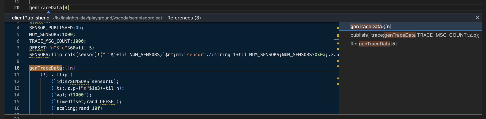
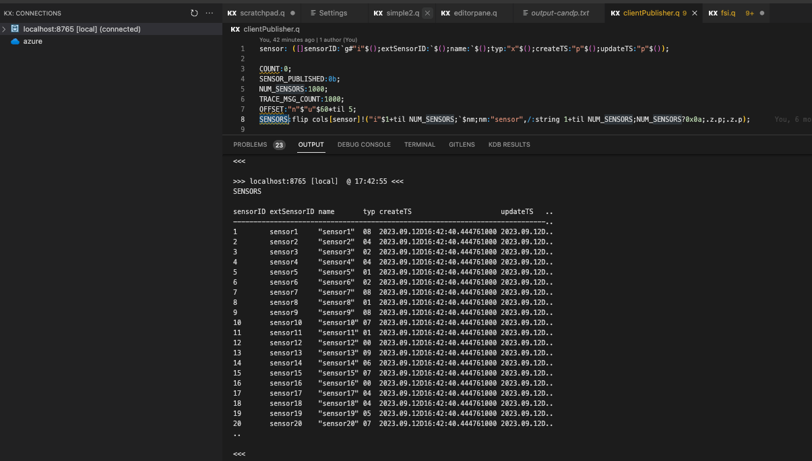
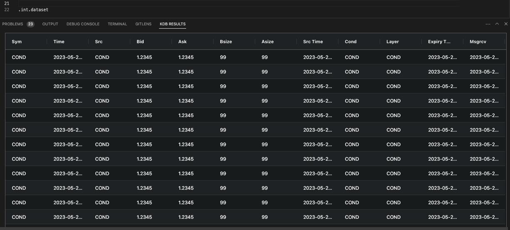

# kdb Visual Studio Code extension

The kdb VS Code extension is intended for q/kdb developers.  It provides a workflow to install q and to allow the runtime management of q processes from with VS Code. It includes editing capabilities for working with q files, and the ability to connect to kdb processes and run queries.

## Contents

- [Overview](#overview)
- [Install q](#install-q-using-the-extension)
- [Connections](#connections)
- [kdb language server](#kdb-language-server)
- [Execute code](#execute-code)
- [View results](#view-results)
- [Shortcuts](#shortcuts)

## Overview

Use this extension to:

- Install q
- Highlight and autocomplete syntax in a raw q process or within an instance of kdb Insights Enterprise
- Execute code for single line, selection and full scripts
- Execute q code from within kdb Insights Enterprise
- View results

## Install q using the extension

<!-- FIXME - this section needs screenshots -->

Click **Install runtime**.

You are prompted to provide a license key.
    
- If you have a license key, click **Select/Enter a license**

    Choose one of the following options:
  
    - Paste license string

        Paste your base64 encoded license string. This is provided by KX in an email.

    - Select license file
    
        If KX provided a license file, which you downloaded, choose this option and specify the file.

        A success message is displayed.

- If you do not have a license key, click **Acquire license**.

    At the prompt, click **Open** to go to https://kx.com/kdb-personal-edition-download, where you can sign up for our 12-month free trial of kdb+ Personal Edition. You can, alternatively, contact our licensing department at licadmin@kx.com if you want to buy a full commercial license.

    When you receive a license email from KX, return to VS Code and click **Continue** at the prompt in the bottom right-hand corner. From here, you are prompted to specify a license key string or file as above.

    A success notice is displayed.

**Note:** to use q outside of VS code, set the [*QHOME*] environment variable and update your [*PATH*](https://code.kx.com/q/learn/install). You can see the location of the q installation from the kdb extension settings..

## Connections

From the extension, you can connect directly to a q session, or to an instance of kdb Insights Enterprise. Begin by reading about how the connections work.

To make a connection, you must:

1. Configure the connection.

    Several connection types are available (see below).

2. Connect VS Code to the configured connection.

### Connection types

We provide these connection types:

- **Managed q session**

    You can use VS Code's controls to start and stop a managed connection. When you exit VS Code, the q process stops. When you [create the connection configuration](#connect-to-a-q-session), set the alias as 'local'.
    
- **Unmanaged q session**

    You manage the q process outside of VS Code. The q process runs irrespective of whether you have VS Code open or not. When you [create the connection configuration](#connect-to-a-q-session), set the alias to something other than 'local' or 'insights'.

- **kdb Insights Enterprise**

    You can [connect to an instance of kdb Insights Enterprise](#connect-to-an-instance-of-kdb-insights-enterprise).

<!-- FIXME do we need this screen shot right here? Might be better later on as the ta daaa moment when you've connected      -->

### Connect to a q session

A q session may be [managed or unmanaged](#connection-types). 

To configure a connection to a q session and connect to it, use these steps:

1. Enable the q process to communicate with VS Code.
 
    To do this, [set the q process to listen on a port](https://code.kx.com/q/basics/ipc).

    Make a note of the port number that you use; you need this in the next step.

1. Configure the connection in VS Code.

    To do this, click **Connect to kdb server** in the KX side bar.
   
    
   
    If this button is not displayed, select **Add new connection** from the context menu.
   
    
   
    Select *Enter a kdb endpoint* and respond to the prompts:

    *Enter a name or alias for the connection*

    This name determines whether the connection is managed or unmanaged.

    To configure a managed connection, enter *local* here.

    To configure an unmanaged connection, enter any name apart from *local* or *insights* here.
    
    *Enter the host name or ip address of the kdb server*

    <!-- FIXME more description needed -->

    *Enter the port number of the kdb server*

    Type in the number of the port that you set up earlier.
    
    *Enter a username to authenticate with (optional)*

    <!-- FIXME more description needed -->

    *Enter a password to authenticate with (optional)*

    <!-- FIXME more description needed -->

    *Enable TLS encryption on kdb connection (optional)*

    <!-- FIXME more description needed -->

   **Note:** To delete a connection configuration, right-click it and select **Remove Connection**.
    
1. Tell the kdb VS Code extension which configuration to connect to.

    To do this, right-click the relevant connection configuration in the KX side bar and select **Connect kdb server**.
    
    A success message is displayed in the bottom, right-hand corner of the screen.

    You are ready to [execute code](#execute-code).

### Connect to an instance of kdb Insights Enterprise

To configure a connection to an instance of kdb Insights Enterprise and connect to it, use these steps:

1. Specify details of the kdb Insights Enterprise endpoint in VS Code.

    To do this, click **Connect to kdb server** in the KX side bar.

    

    Select *Connect to kdb Insights Enterprise* and respond to the prompts:

    *Enter a name or alias for the connection*

    <!-- FIXME more description needed - is this also a managed vs unmanaged option? -->

    *Enter the Insights endpoint URL*

    Type or paste in the URL of the kdb Insights Enterprise instance to which you want to connect.

    **Note:** To delete a connection configuration, right-click it and select **Remove Connection**.

1. Tell the kdb VS Code extension which instance of kdb Insights Enterprise to connect to.

    To do this, right-click the relevant connection configuration in the KX side bar and select **Connect to Insights**.

    

    The instance of kdb Insights Enterprise is displayed.

    You are ready to [execute code](#execute-code).

## kdb language server

A kdb language server is bundled with the kdb VS Code extension. It offers various common features to aid in the development of kdb code within VS Code, including:

- [Syntax highlighting and linting](#syntax-highlighting)
- [Code navigation](#code-navigation)
- [Code completion](#code-completion)

### Syntax highlighting

The extension provides keyword syntax highlighting, comments and linting help.

### Code navigation

While developing q scripts, the kdb VS Code extension supports:

- Go to definition

  Navigate to the definition of a function

- Call hierarchy

  View the call stack from the selected function

  <!-- FIXME Diagram -->

- Find/go to all references
  
  View references of a function both on the side view and inline with the editor
  
  

  

### Code Completion

- Keyword auto complete for the q language 

  

- Autocomplete for local and remotely connected q processes

  <!-- FIXME INSERT DIAGRAM -->

## Execute code

Leaning on VS Code's extensive integrations with SCMs, all code is typically stored and loaded into a VS Code workspace. From there, the kdb VS Code extension allows you to execute that code in a number of ways against both kdb processes and kdb Insights Enterprise endpoints.

### kdb process executing code

There are three options, which are available from the right-click menu, for executing code against a connected kdb process:

- Execute current selection

    Takes the current selection (or current line if nothing is selected) and executes it against the connected q process. Results are displayed in the [output window and/or the kdb results window](#view-results).

    

- Execute entire file

    Takes the current file and executes it against the connected q process. Results are displayed in the [output window](#view-results). Returned data are displayed in the [kdb results window](#view-results).

- Run q file in new q instance

    If q is installed and executable from the terminal, you can execute an entire script on a newly launched q instance using this option. When executing a file on a new instance, it launches in the terminal and allows you to interrogate the active q process from the terminal window within VS Code.

### Insights query execution

kdb Insights Enterprise offers enhanced connectivity and enterprise level API endpoints, providing additional means to query data and interact with kdb Insights Enterprise that are not available with kdb processes. You must have an instance of kdb Insights Enterprise running and have created a connection to it within the kdb VS Code extension.

Similarly, you can execute arbitrary code against kdb Insights Enterprise. The code is executed on a user-specific sandbox process within the kdb Insights Enterprise deploy. The sandbox is instanciated upon the first request to execute code when connected to a kdb Insights Enterprise connection. It remains active until timed out or until you log out.

#### Data sources

kdb Insights Enterprise supports the use of data sources, where you can build a query within VS Code and run it against the [kdb Insights Enterprise API endpoints](https://code.kx.com/insights/api/index.html). The UI helps you to build a query based on the available API on your instance of kdb Insights Enterprise, parameterize it and return the data results to the output or kdb results window.

To create a data source:

1. In the Data Sources view, click the Options button and select 'Add Data Source'.
    
1. Click on the created data source where the name, API and parameterization can be applied.
    
1. Click Save to persist the data source to the VS Code workspace.

To run a data source, click 'Run' and the results populate the output and kdb results windows.

In addition to API queries, if the query environment is enabled on the deployed instance of kdb Insights Enterprise, QSQL and SQL queries can be used within a data source with the appropriate parameterization.

#### Populate scratchpad

You can use a data source to populate a scratchpad with a dataset, allowing you to build complex APIs and pipelines within VS Code and kdb Insights Enterprise. 

To do this:

1. Create a data source and execute it using the 'Populate Scratchpad' button.
    The scratchpad is populated.
   
1. At the prompt, provide a variable to populate your own scratchpad instance with the data.

1. Return to VS Code and execute q code against the data in your scratchpad.

## View results

All query executions happen remotely from the kdb VS Code extension either against a running q process or against an instance of kdb Insights Enterprise. The results, successful or otherwise are returned to VS Code to be displayed in two different views:

- Output view

    The output view displays results as they are received by the kdb VS Code extension. It includes the query executed, a timestamp and the results.

    

    **Note:** You can enable/disable auto-scrolling in the VS Code settings. This setting determines whether the output view scrolls to the latest results.

    

- kdb results view

    Results are displayed under the kdb results view, which shows the returned data in a table.

    

## Shortcuts

| Key | Action |
| - | - |
| F12 | Go to definition |
| Shift + F12 | Go to references |
| Cmd/Ctrl + Shift + F12 | Find all references |
| Ctrl + Q | Execute current selection |
| Ctrl + Shift + Q | Execute entire file |
| Ctrl + Shift + R | Run q file in new q instance |
