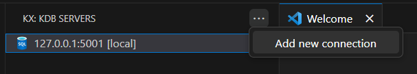
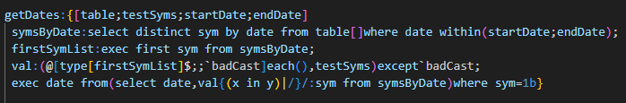
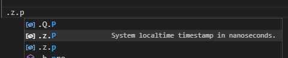

# kdb VS Code extension [Internal Beta]

> Internal Beta - for internal evalution by KX staff only

This is a companion extension for kdb developers including editor features for working with q files along with the ability to connect to kdb processes and run queries

## Install

Follow the extension walkthrough to install q, if required

## Get Started

  
Add a connection

  Add a new server connection by opening the extension side panel and choosing 'Add new connection' from the context menu

  

  
Connect to a server

Connect to an existing server by right-clicking and choosing 'Connect kdb server'

  
Execute code

q files can be executed by right-clicking the editor and choosing 'Execute Entire File', results will be shown in the Output pane

## More

  
Syntax highlighting

  
Code navigation

  
Code completion

## Support/Feedback

Any feedback is welcome via the KX [#vscode-extension-help](https://kxsys.slack.com/archives/C057T0J659N) Slack channel
