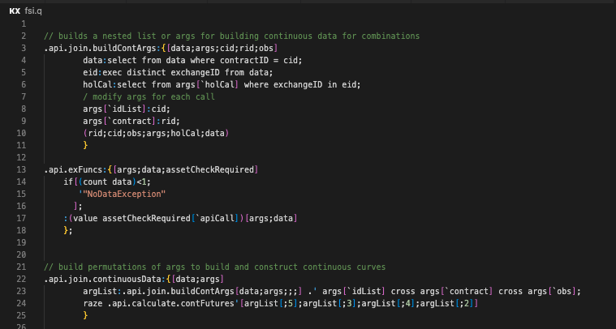
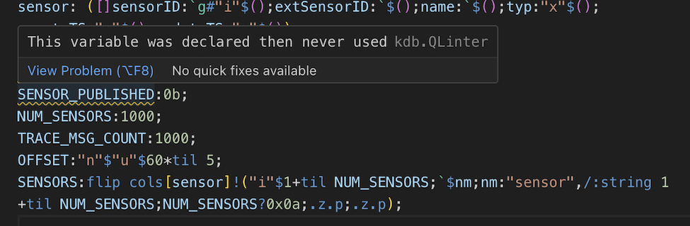
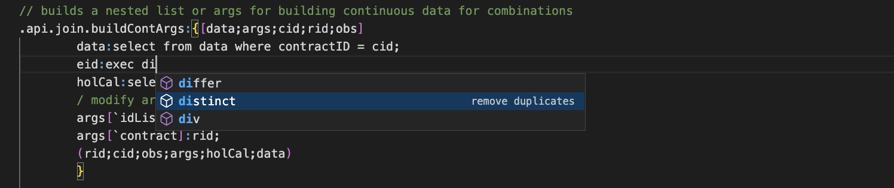
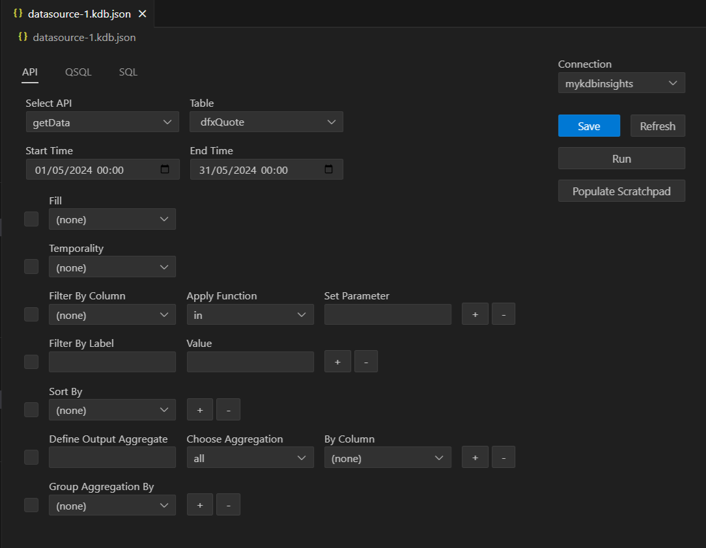
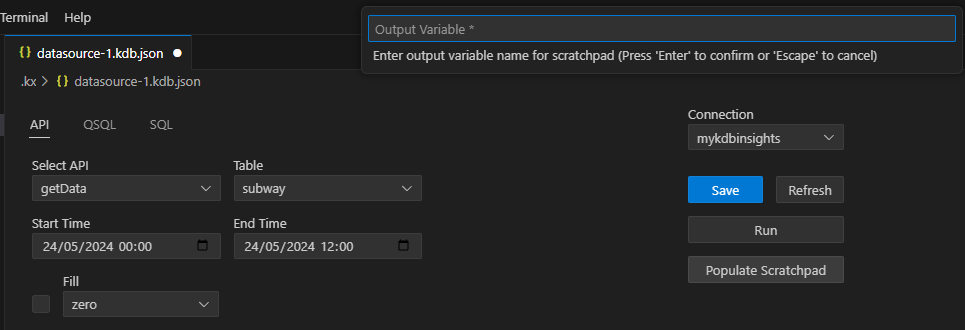

# kdb Visual Studio Code extension

This is a companion extension for kdb developers. It provides editing capabilities for working with q files, and the ability to connect to kdb processes and run queries.

## Contents

- [Overview](#overview)
- [Getting Started](#getting-started)
- [Connections](#connections)
- [kdb language server](#kdb-language-server)
- [Executing code](#executing-code)
- [Viewing results](#viewing-results)
- [Shortcuts](#shortcuts)

## Overview

Use this extension to:

- Predict and complete q syntax in a q session or within an instance of kdb Insights Enterprise
- Execute a line of q code, a section of q code, or a file of q code in a q session
- Execute q code from within kdb Insights Enterprise
- View results

## Getting started

The kdb VS Code extension provides a workflow to install q and to allow the runtime management of q processes from with VS Code.

With the kdb VS Code extension you can:

1. Install q
1. Start q
1. Configure connections between VS Code and q or kdb Insights Enterprise
1. Connect VS Code to q or kdb Insights Enterprise

**If you already have q installed locally**

When you install the extension, the message **q runtime installed** is displayed. You can now [start q](#start-q).

**If you do not have q installed**

When you install the extension, you are instructed to do one of the following:

- Install q locally using the [instructions on our documentation website](https://code.kx.com/q/learn/install)
- [Install q using the extension](#install-q-using-the-extension)

### Install q using the extension

TODO - this section needs screenshots

Click **Install runtime**.

You are prompted to provide a license key.
    
- If you have a license key, click **Select/Enter a license**

    Choose one of the following options:
  
    - Paste license string

        Paste your base64 encoded license string. This is provided by KX in an email.

    - Select license file
    
        If KX provided a license file, which you downloaded, choose this option and specify the file.

        A success message is displayed and you can [start q](#start-q).

- If you do not have a license key, click **Acquire license**.

    At the prompt, click **Open** to go to https://kx.com/kdb-personal-edition-download, where you can sign up for our 12-month free trial of kdb+ Personal Edition. You can, alternatively, contact our licensing department at licadmin@kx.com if you want to buy a full commercial license.

    When you receive a license email from KX, return to VS Code and click **Continue** at the prompt in the bottom right-hand corner. From here, you are prompted to specify a license key string or file as above.

    A success notice is displayed and you can [start q](#start-q).

**Note:** ensure that the system variable [*QHOME*](https://code.kx.com/q/learn/install)) is defined and that the location of your q folder is specified in the *Path* system variable.

### Start q

If you just installed q using the extension, the last prompt is to **Start q**.

If you already had q installed, launch it as usual (by typing '/q' at the command prompt).

From the extension, you can now connect directly to a q session, or to an instance of kdb Insights Enterprise. Begin by reading about how the connections work.

## Connections

### Connection types

We provide these connection types:

- **Managed q session** - alias 'local'

    You can use VS Code's controls to start and stop a managed connection. When you exit VS Code, the q process stops. To allow VS Code to manage a q process, set the alias as 'local' when creating it.
    
- **Unmanaged q session**

    You manage the q process outside of VS Code. The q process runs irrespective of whether you have VS Code open or not. When creating a connection in VS Code, set the alias to something other than 'local' or 'insights'.

- **kdb Insights Enterprise**

    You can connect to an instance of kdb Insights Enterprise.

### Managing kdb connections

A q session may be [managed or unmanaged](#connection-types). 

To add and connect to a q session use these steps:

1. Enable the q process to communicate with VS Code.
 
    To do this, [set the q process to listen on a port](https://code.kx.com/q/basics/ipc).

    Make a note of the port number that you use; you need this in the next step.

1. Configure the connection in VS Code.

    To do this, click **Connect to kdb server** in the KX side bar.
   
    FIXME image resources/images/connecttokdbserver.jpg
   
    If this button is not displayed, select **Add new connection** from the context menu.
   
    FIXME image resources/images/addnewconnection.jpg
   
    Select *Enter a kdb endpoint* and respond to the prompts:

    FIXME a table might be better for the prompts
    
    *Enter a name or alias for the connection*

    This name determines whether the connection is managed or unmanaged.

    To configure a managed connection, enter *local* here.

    To configure an unmanaged connection, enter any name here.
    
    *Enter the host name or ip address of the kdb server*

    FIXME more description needed

    *Enter the port number of the kdb server*

    Type in the number of the port that you set up earlier.
    
    *Enter a username to authenticate with (optional)*

    FIXME more description needed

    *Enter a password to authenticate with (optional)*

    FIXME more description needed

    *Enable TLS encryption on kdb connection (optional)*

    FIXME more description needed
    
1. Tell the kdb VS Code extension which configuration to connect to.

    To do this, right-click the relevant connection configuration in the KX side bar and select **Connect kdb server**.
    
    A success message is displayed in the bottom, right-hand corner of the screen.

    FIXME link to a section about executing code

A connection can be removed by right clicking the connection and selecting 'Remove Connection'

TODO Insert diagram

### Connect to an instance of kdb Insights Enterprise

To add and connect to a kdb Insights Enterprise connection use these steps:

1. Specify details of the kdb Insights Enterprise endpoint in VS Code.

    To do this, click **Connect to kdb server** in the KX side bar.

    FIXME image resources/images/connecttokdbserver.jpg

    Select *Connect to kdb Insights Enterprise* and respond to the prompts:

    *Enter a name or alias for the connection*

    FIXME more description needed - is this also a managed vs unmanaged option?

    *Enter the Insights endpoint URL*

    Type or paste in the URL of the kdb Insights Enterprise instance to which you want to connect.

1. Tell the kdb VS Code extension which instance of kdb Insights Enterprise to connect to.

    To do this, right-click the relevant connection configuration in the KX side bar and select **Connect to Insights**.

    FIXME image resources/images/connecttoinsightscontext.jpg

    The instance of kdb Insights Enterprise is displayed.

    FIXME link to a section about executing code

A connection can be removed by right clicking the connection and selecting 'Remove Connection'

TODO Insert diagram

## kdb language server

A kdb language server is bundled with the kdb VS Code extension this offers various common features to aid in the development of kdb code within VS Code including

- Syntax highlighting and linting
- Code Naivigation
- Code Completion

### Syntax highlighting

Key word syntax highlighting, comments and linting help

### Code Navigation

While developing q scripts, the kdb VS Code extension supports

- Go to Definition
  Allowing the user to navigate to eh definition of a function

- Call Hierarchy
  To view the call stack from the selected function

  TODO Diagram

- Find all References/Go to References
  
  To view references of a function both on the side view and inline with the editor
  

  

### Code Completion

- Keyword auto complete for the q language 

  

- Autocomplete of local and remotely connected q process autocomplete

  TODO INSERT DIAGRAM

## Executing code

Leaning on VS Code's extensive integrations with SCMs all code is typically stored and loaded into a VS Code workspace. From there the kdb VS Code extension allows the user to execute that code in a number of ways against both kdb processes and Insights endpoints. TODO Insert link to creating connections

### kdb process executing code

There are three options for executing code against a connected kdb process;avaialble via the right click menu

#### Execute Current Selection

This will take the current selection (or current line if nothing selected) and execute it against the connected q process. The results will apepar in the OUPUT window (TOOD INSERT LINK) and/or the KDB RESULTS window (TODO INSERT LINK)

#### Execute entire file

tthis will take the current file and execute it against the connected q process. Link (TODO LINK TO ABOVE) the results will apepar in teh OUTPUT window  (TODO INSERT LINK). If it returns data the results will appear in the KDB RESULTS window  (TODO INSERT LINK)

#### Run q file in new q instance

If q is installed and executabel from teh terminal, it is possible to execute and entire script on a newly launch q instance with this option. When executing a file on a new instance, it will launch in the terminal and allow the user to interrogate the active q process from the terminal window within VS Code

### Insights query execution

The kdb Insights Platform offers enhanced connectivity and Enterprise level API endpoints offering additional means to query data and interact with Insights which is not available with kdb processes. It is necessary to have an instance of Insight Enterprise running and have created a connection to it (TODO INSERT LINK) within the kdb VS Code extension

Similarly to above (TODO insert link), we can execute arbitary code against Insights. This will be executed on a user specific sandbox process within the Insights deploy. This sandbox will be instanciated upon the first request to execute code when connected to an Insights connection and will remain active until timed out; or the user is logged out. 

#### Data Sources

In addition to code execution against scratchpads, Insights also support Data Sources where users can build a query within VS Code which can be executed against the Insights API endpoints (TODO INSERT LINK TO API DOCS on code.kx.com). The UI helps users build a query based on the available API on their instance of Insights; parameterise it and return the data results to the OUTPUT or KDB Results window

To create a Data Source

- In the Data Sources view, click the options button and select 'Add Data Source'
- click on the created data source where the name, API and parameterization can be applied
- 'Save' will persist the Data source to the VS Code workspace

To run the data source, click on 'Run' and the results will populate the OUTPUT (TODO INSERT LINK) and KDB RESULTS (TODO INSERT LINK) windows

In addition to API queries, if the Query Environment is enabled on the deployed instance of Insights; QSQL and SQL queries can be used within a Data Source with the appropriate parameterization

#### Populate Scratchpad

A common ask is to populate a user scratchpad with a dataset to allow the user to build complex APIs and pipelines within VS Code and kdb Inisghts. This can be achieved with Data Source, which when created can be executed to populate the scratchpad with the 'Populate Scratchpad' button. The user will be asked for a variable to populate the data to on their scratchpad instance, then can return to their editor and execute q code against the data which has pushed to their scratchpad instance

## Viewing results

All query executions happen remotely to the kdb VS Code extension either against a running q process; or an instance of kdb Insights Enterprise. The result, successful or otherwise are returned to VS Code to be displayed in two different views

### Output view

The output view displays the results as they are received by the kdb VS Code extension. This will include the query executed; timestamp and the results

!!!note
    Auto scrolling can be enabled/disabled within the VS Code settings. This setting will set whether this view scrolls to the latest results

    

### KDB Results view
In addition to this the results are displayed under the KDB RESULTS view which offers a tabulised view of the returned data

## Shortcuts

| Key | Action |
| - | - |
| F12 | Go to Definition |
| Shift + F12 | Go to References |
| Cmd/Ctrl + Shift + F12 | Find All References |
| Ctrl + Q | Execute Current Selection |
| Ctrl + Shift + Q | Execute Entire File |
| Ctrl + Shift + R | Run q file in new q instance |
