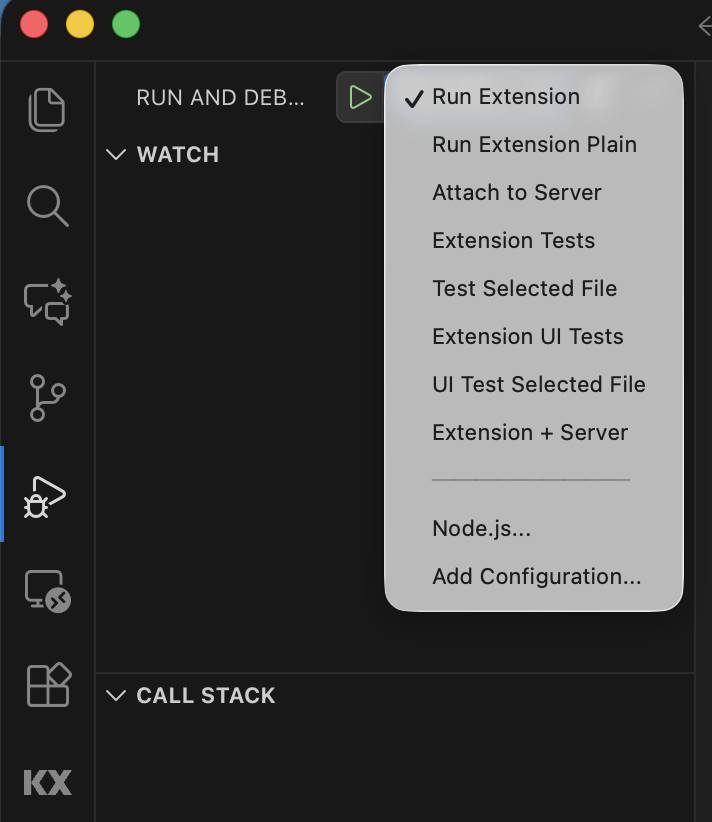
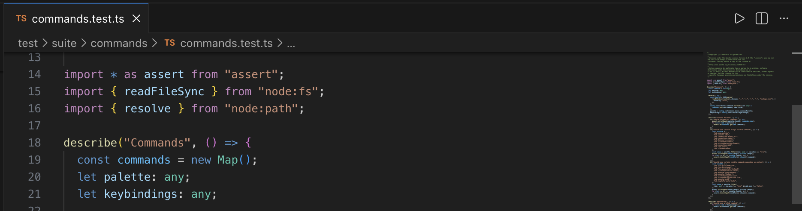

## Setup

```sh
git clone https://github.com/KxSystems/kx-vscode.git
npm install
```

## Recommended Extensions

- [ESLint](https://marketplace.visualstudio.com/items?itemName=dbaeumer.vscode-eslint)
- [Prettier](https://marketplace.visualstudio.com/items?itemName=esbenp.prettier-vscode)
- [lit-plugin](https://marketplace.visualstudio.com/items?itemName=runem.lit-plugin)
- [Debug Configuration Launcher](https://marketplace.visualstudio.com/items?itemName=ecmel.vscode-launcher)
- [SonarQube](https://marketplace.visualstudio.com/items?itemName=SonarSource.sonarlint-vscode)

## Scripts

Run these with `npm run scriptName`

| Script        | Description                                 |
| :------------ | :------------------------------------------ |
| `update-deps` | Update dependencies to latest patch version |
| `format`      | Format all `ts` files                       |
| `lint`        | Lint all `ts` files                         |
| `package`     | Produce `vsix`                              |
| `test`        | Perform [Unit Tests](https://github.com/KxSystems/kx-vscode/tree/dev/test/suite)|
| `coverage`    | Produce coverage reports|
| `ui-test`     | Perform [UI Tests](https://github.com/KxSystems/kx-vscode/tree/dev/test/ui)|
| `q-test`      | Perform [q Tests](https://github.com/KxSystems/kx-vscode/tree/dev/test/q/tests)|

## Configuring SonarQube

Once you've installed the [SonarQube Extension](https://marketplace.visualstudio.com/items?itemName=SonarSource.sonarlint-vscode), add the KX SonarQube server `https://sonarqube.dl.kx.com`, and it will lint as you type, so you don't need to wait for the github pipeline to discover issues.

Ctrl + Shift + P -> "SonarQube: Analyze Current File with SonarQube" will give you a a detailed summary of any issues in a file.

SonarQube results can be viewed at https://sonarqube.dl.kx.com/dashboard?branch=dev&id=kxvscode

## Debugging

Pressing F5 with a file in the extension open will launch a VSCode instance running the extension built from source, with the debugger open in the original VSCode instance.

Extension [Unit Tests](https://github.com/KxSystems/kx-vscode/tree/dev/test/suite) can be debugged by selecting `Extension Tests` target from run and debug tab.

Extension [UI Tests](https://github.com/KxSystems/kx-vscode/tree/dev/test/ui) can be debugged by selecting `Extension UI Tests` target from run and debug tab. UI Tests use [Page Object APIs](https://github.com/redhat-developer/vscode-extension-tester/wiki/Page-Object-APIs).

Testing will stop at any breakpoint set in test or source file.



Single test file can also be debugged by clicking run button from the editor toolbar:



## q Testing

To run the tests locally, you need to
1. Install Python version 3.12 installed, as the tests rely on an old version of pykx that doesn't support the latest Python
```
~/kx-vscode $ brew install python@3.12
~/kx-vscode $ python3.12 -m venv venv
~/kx-vscode $ source venv/bin/activate
```

2. Install pykx by running the following. If you aren't running the right Python version, PyKX 2.5 won't be available. More detailed instructions are available [here](https://code.kx.com/pykx/pykx-under-q/intro.html)
```
~/kx-vscode $ zsh ./test/q/preTest.sh
```

3. kdb+ installed, with the `q` executable in the system path
4. [AxLibraries](https://code.kx.com/developer/getting-started/) should be installed, according to its readme.

You can then run the tests with `npm run q-test`.

To debug the tests, create a file with a username and password to secure the q process, then start a q process using that authentication.
```
$ echo "myusername:mypassword" >> users.txt
$ q -u users.txt -p 1234
KDB-X 5.0 2026.01.22 Copyright (C) 1993-2026 Kx Systems
l64/ 16()core 15644MB myusername hostname 127.0.1.1 EXPIRE 2027.01.13 email@example.com

q)\l qcumber.q
q)\l test/q/main.q
```

You can now connect to the process on port 1234 and step through the tests

## Restart Extension Host

`ctrl`/`⌘`+`r` will restart extension host.

## Dependencies

List outdated dependencies:

```sh
npm exec ncu
```

## Releasing a new version

Let Veronica, or the #docs channel if she is unavailable, know that a release is about to go out so they can publish the docs concurrently.

Check out the branch to release, update the version number in package.json, then run
```
git tag v1.2.3
git push origin v1.2.3
```
Then, in the [Actions](https://github.com/KxSystems/kx-vscode/actions) tab, open the pipeline that was just created, and give manual approval once the action reaches that point. It can take 10 minutes for the version number to be updated in the extension marketplace, even after it updates the timestamp to reflect the new release.

Announce the release in #kx-product-releases, using the template
```
:rocket: VSCode Extension x.y.z has been released

https://github.com/KxSystems/kx-vscode/releases/tag/vX.Y.Z
https://marketplace.visualstudio.com/items?itemName=KX.kdb


vX.Y.Z
Release date: [Today's Date]

[The change log, which can be found by clicking the release [here](https://github.com/KxSystems/kx-vscode/tags)]
```
