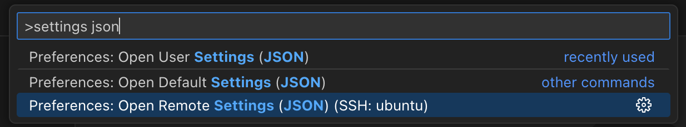

## Locating `q`

`QHOME` environment variable and `kdb.qHomeDirectory` setting are identical from the viewpoint of VS Code and they are used to locate the `q` executable for REPL.

When `QHOME` is set through operating system, `QHOME` will always be used instead of `kdb.qHomeDirectory`. A workspace [`.env` file](env-files.md) can also be used to set `QHOME` and other environment variables specific to the workspace.

`kdb.qHomeDirectory` setting is in `machine` scope which means it can be set differently per remote machine.

For workspace specific use case, `kdb.qHomeDirectoryWorkspace` which is in `resource` scope should be used in `.vscode/settings.json` and it overrides `QHOME` as well and will be used to launch `q` for the specific workspace only.

If neither `qHomeDirectoryWorkspace`, `QHOME` nor `qHomeDirectory` is set in any scope, the default `KDB-X` install location `$HOME/.kx` is checked first then system path is searched for a `KDB-X` installation.

## Remote Settings

[Settings](https://code.visualstudio.com/docs/configure/settings#_settings-precedence) for remote machine can be accessed with the following command after the remote connection is established:

