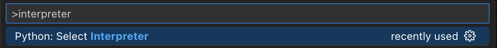
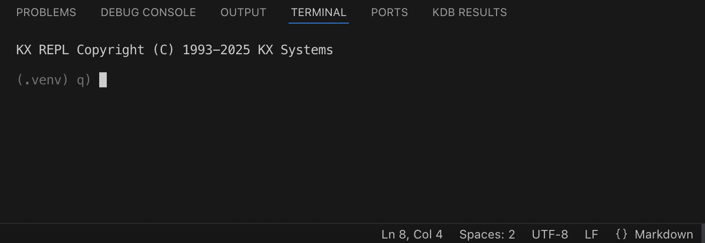

## Installation Steps

1. Install [kdb](https://marketplace.visualstudio.com/items?itemName=KX.kdb) and [Python](https://marketplace.visualstudio.com/items?itemName=ms-python.python) extensions in VS Code.
2. Install [KDB-X](https://code.kx.com/kdb-x/get_started/kdb-x-install.html) from welcome page.
3. Open a [workspace](https://code.visualstudio.com/docs/editing/workspaces/workspaces) folder in VS Code.
4. Create or select a `Virtual Environment (venv)` through command palette:



5. Create a `.env` file in the root of the workspace with the following:

```
PYKX_USE_FIND_LIBPYTHON="true"
```

6. Start a VS Code terminal and install PyKX and q integration in the selected environment:

```
pip install --upgrade find-libpython
```
```
pip install --upgrade --pre pykx
```
```
python -c "import pykx;pykx.install_into_QHOME(to_local_folder='$HOME/.kx')"
```

7. Start KX REPL and test your installation:

```
\l pykx.q
```


## Documentation

For more information see [KDB-X](https://code.kx.com/kdb-x), [PyKX](https://code.kx.com/kdb-x/get_started/kdb-x-python-install.html#make-kdb-x-python-available-within-kdb-x) and [VS Code](https://code.visualstudio.com/docs/python/environments#_environment-variables) documentation.
