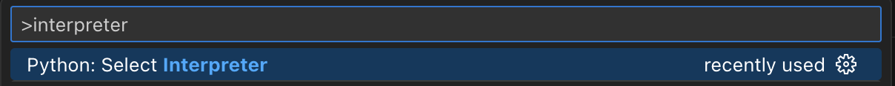
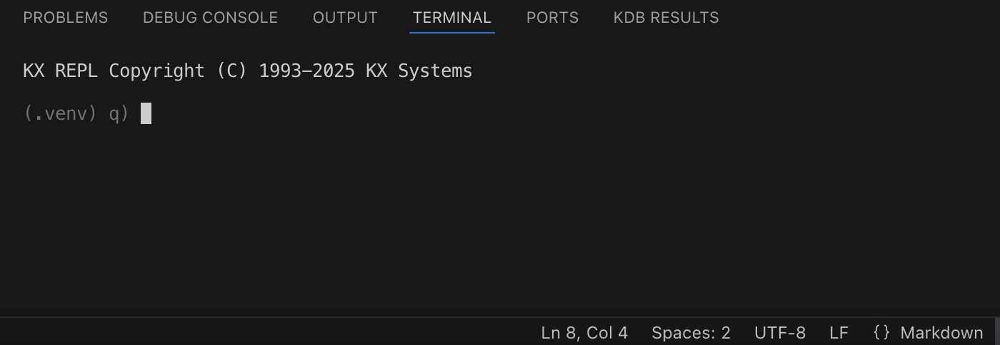

## Installation Steps

1. Install [kdb](https://marketplace.visualstudio.com/items?itemName=KX.kdb) and [Python](https://marketplace.visualstudio.com/items?itemName=ms-python.python) extensions in VS Code. The Python extension installs [Python Environments](https://marketplace.visualstudio.com/items?itemName=ms-python.vscode-python-envs) with it, which is where the REPL finds your environment.
2. Install [KDB-X](https://code.kx.com/kdb-x/get_started/kdb-x-install.html) from welcome page.
3. Open a [workspace](https://code.visualstudio.com/docs/editing/workspaces/workspaces) folder in VS Code.
4. Create or select a Python environment for the folder through the command palette or the Python Environments view.



5. Start a VS Code terminal and install PyKX and q integration in the selected environment:

```
pip install --upgrade pykx
```
```
python -c "import pykx;pykx.install_into_QHOME(to_local_folder='$HOME/.kx')"
```

6. Start KX REPL and test your installation:

```
\l pykx.q
```


## How the REPL uses the environment

When a REPL starts, it asks Python Environments for the environment selected for
its folder: the workspace folder for **KX: Start REPL**, the folder you picked
for **KX: Start REPL Here**, so each project folder can have its own.

- The environment is activated before q starts, the way a VS Code terminal
  activates it, and its name is shown before the prompt. An environment with
  nothing to activate starts without a name. If the activation fails, its error
  is shown in the REPL and q starts without the environment.
- `PYKX_EXECUTABLE` is set to the environment's Python, so `\l pykx.q` loads
  PyKX from that environment. A `PYKX_EXECUTABLE` already set, for example in
  the `.env` file at the root of the workspace folder, is kept. When the path to
  the environment's Python contains spaces it is not set, and PyKX uses the
  `python` the activation puts first on the path.
- A REPL keeps the environment it started with. After selecting another one,
  close the REPL and start it again.

If Python Environments is not installed, or is turned off with
`python.useEnvironmentsExtension`, the REPL starts without an environment. Set
`PYKX_EXECUTABLE` to the path of the Python to use in a `.env` file at the root
of the workspace folder instead.

## Windows

KDB-X runs in WSL. Open the folder in WSL, with **WSL: Open Folder in WSL...**
or `code .` from a WSL shell, and install the Python extension in WSL when VS
Code offers to. The REPL, KDB-X, the Python environment and PyKX then all run
inside WSL, and the steps above apply unchanged.

Without WSL, KDB-X is not available and the REPL uses kdb+ instead:

- In step 2, use **Set QHOME** on the welcome page to select your kdb+ folder
  instead of installing KDB-X. If `QHOME` is already set to your kdb+ folder,
  skip this.
- In step 5, install the q integration into your kdb+ folder, replacing `C:/q`
  with its path:

```
python -c "import pykx;pykx.install_into_QHOME(to_local_folder='C:/q')"
```

## Troubleshooting

If `\l pykx.q` reports that it cannot find the Python shared library, install
`find-libpython` in the environment:

```
pip install --upgrade find-libpython
```

and create a `.env` file in the root of the workspace folder with the following,
then start the REPL again:

```
PYKX_USE_FIND_LIBPYTHON="true"
```

## Documentation

For more information see [KDB-X](https://code.kx.com/kdb-x), [PyKX](https://code.kx.com/kdb-x/get_started/kdb-x-python-install.html#make-kdb-x-python-available-within-kdb-x) and [VS Code](https://code.visualstudio.com/docs/python/environments#_environment-variables) documentation.
