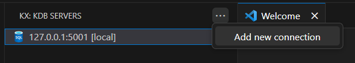

# Add a connection

Connections provide details that allow the extension to connect to and interact with kdb servers

Further connections can be added by choosing 'Add a connection' from the context menu in the extension panel

## kdb

| Parameter | Description                              |
| --------- | ---------------------------------------- |
| alias     | User chosen alias for this connection    |
| hostname  | URL or IP address to the kdb server      |
| port      | Port number of kdb server                |
| username  | Username to authenticate with (optional) |
| password  | Password to authenticate with (optional) |
