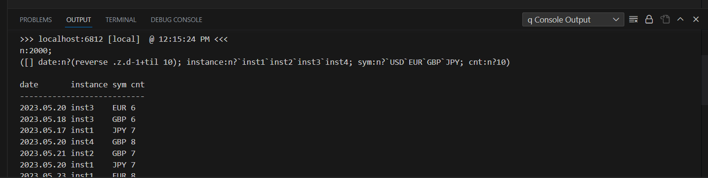

# Execute code

Create and save a new .q file and populate it with this sample code

```q
n:2000;
([] date:n?(reverse .z.d-1+til 10); instance:n?`inst1`inst2`inst3`inst4; sym:n?`USD`EUR`GBP`JPY; cnt:n?10)
```

Right-click the editor pane and choose 'Execute Entire File'

The result of the execution will be shown in the 'q Console Output' pane


